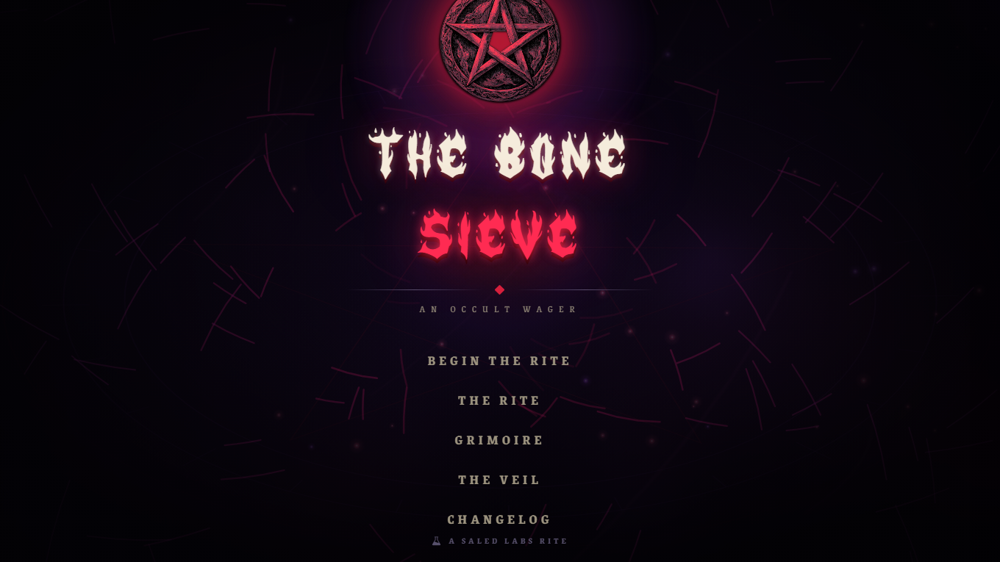
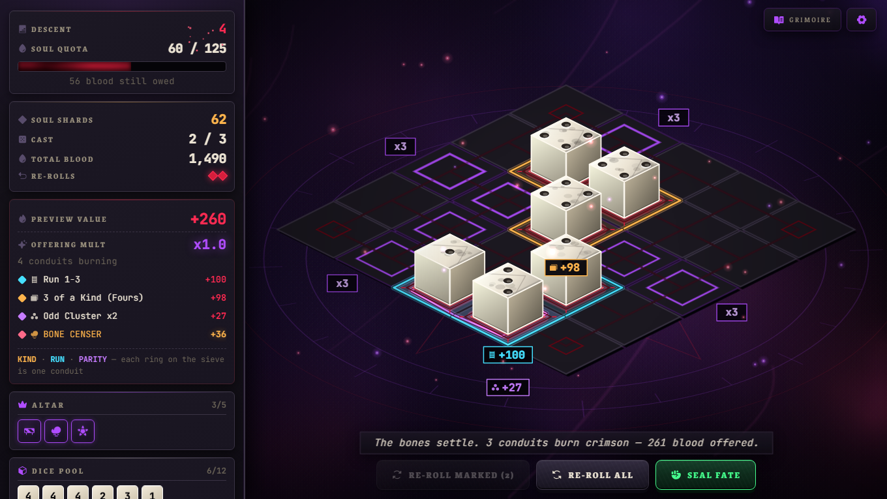
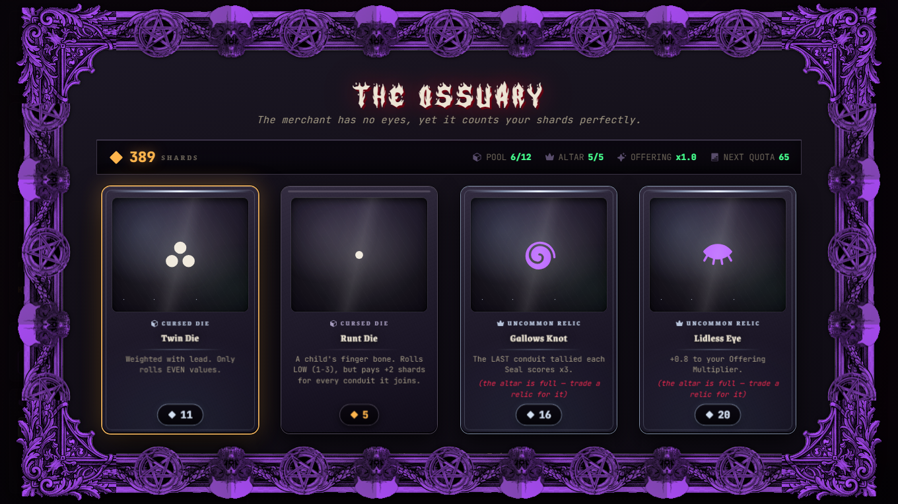
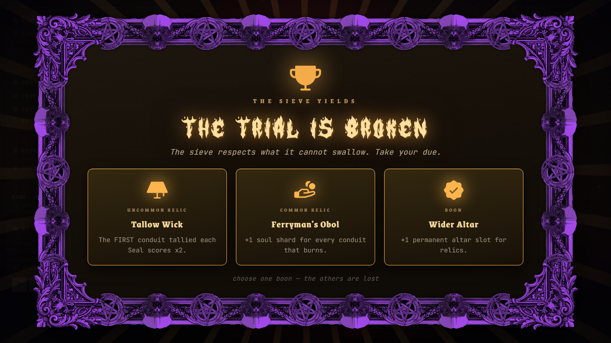

<div align="center">

# THE BONE SIEVE

**An occult gambling roguelite. Six knuckles of a dead saint, a grid of hungry stone — feed it.**

[](#play-it)
[](CHANGELOG.md)
[](#running-it-locally)



</div>

---

## What it is

You cast six bones onto a five-by-five slab and the stone decides what they are
worth. Dice that touch form **conduits** — matching values, consecutive runs,
clusters of pure odd or pure even — and every conduit burns for blood. Bank
enough of it before your casts run out and the sieve lets you descend. Fall
short and it takes you instead.

Between floors you trade at the **Ossuary**: cursed dice that break the rules of
the roll, relics that rewrite the scoring, chalk sigils scrawled across whole
rows of the board. Your altar holds only five relics and your cup only so many
bones, so every purchase past that point is something given up. That choice is
your build.

Every fifth descent is a **Trial** — a cruel rule and a swollen quota. Break one
and the sieve owes you a **Boon**. Past the tenth it also carves a **Decree**
into the rite: permanent, and it never lifts.



---

## Play it

**[▶ Play in your browser](https://kingsaled.github.io/The-Bone-Sieve/)** — no
install, no account, nothing to download.

Or take a copy:

1. Download the latest [**release**](https://github.com/KingSaled/The-Bone-Sieve/releases)
   and unzip it.
2. Open `index.html` in any modern browser.

That is the whole install. Keep the `assets/` folder next to `index.html` — the
ritual typeface and the carved border live in it.

---

## The rite

### Conduits

Dice score in groups. Any dice **orthogonally touching** each other are one
cluster, and a cluster burns if it satisfies any of these:

| Conduit | What it is | Multiplier |
|---|---|---|
| **KIND** | Every die shows the same value | **×3** |
| **RUN** | Three or more consecutive values | **×4** |
| **PARITY** | Every die odd, or every die even | **×1.5** |

Each burning conduit is ringed on the stone in its own colour with its blood
price stamped beside it — gold for Kind, cyan for Run, violet for Parity. A die
sitting inside no ring is earning nothing.

### The loop

1. **Cast the bones.** All six land at once.
2. **Mark and re-roll.** Click any die to mark it, then re-roll just the marked
   ones. Two re-rolls per cast.
3. **Seal Fate** to bank the blood. Total conduit blood is multiplied by your
   **Offering Multiplier** before it lands.
4. Three casts to meet the **Soul Quota**. Meet it and you descend; miss it and
   the run is over.
5. **The Ossuary** opens between floors. Spend Soul Shards, then descend deeper.

Raising the Offering Multiplier is how you survive the deep — the quota climbs
faster than raw dice values ever will.

### Controls

| Key | Action |
|---|---|
| `SPACE` | Cast the bones · Seal Fate |
| `R` | Re-roll marked dice |
| `A` | Re-roll everything |
| `G` | Open the Grimoire |
| `ESC` | Back out of any panel |

Everything is clickable too — the keys are shortcuts, not requirements.

---

## What's in it

|  |  |
|---|---|
| **37 relics** | Permanent effects, from flat blood per conduit to rewriting a conduit type's multiplier outright |
| **11 cursed dice** | Wild faces, doubled neighbours, dice that crumble after one use, dice that refuse to be re-rolled |
| **15 Trials** | One cruel rule per Trial floor, drawn deeper as you descend |
| **5 kinds of Decree** | Permanent escalation carved in after deep Trials — up to six stacked at once, and they can repeat |
| **8 Boons** | The reward for breaking a Trial, if your altar is too full for a relic |
| **Altar chalk** | Sigils scrawled down a row or column, multiplying every conduit that crosses them |



The **Grimoire** (`G`) documents all of it in-game — conduits, your relics,
active Trials and Decrees — so nothing here is knowledge you have to bring with
you.

---

## The Veil

Settings live behind **THE VEIL**, reachable from the title screen or mid-run.

- **Sound** — five independent channels (master, music, dice, ritual, interface).
  Click a speaker to silence it, click a number to type an exact level. All audio
  is generated live in the browser; there are no audio files.
- **Detail** — `HIGH` / `MEDIUM` / `LOW`. Governs particle counts, glow, render
  scale and how thickly the miasma gathers.
- **Typeface** — pick the hand the crypt writes in: *Pirata One*, *Metal Mania*,
  *Pixelify Sans*, *Sixtyfour*, or the default. Each is previewed in its own
  letters. Ritual titles keep their own face regardless.
- **Text size** — 13px to 21px, for whatever screen you are sitting in front of.
  The whole interface scales with it, not just the words.

Audio and view preferences persist in `localStorage`.

---

## Running it locally

There is no build step, no package manager and no dependencies. The game is one
HTML file.

```bash
git clone https://github.com/KingSaled/The-Bone-Sieve.git
cd The-Bone-Sieve
```

Then open `index.html` — double-click it, or serve the folder if you prefer:

```bash
python -m http.server 8000    # then visit http://localhost:8000
```

Opening the file directly works fine. The only thing fetched from the network is
the Google Fonts stylesheet for the optional typefaces; offline, the game falls
back cleanly and everything still plays.

### Project structure

```
index.html                  the entire game — markup, styles, engine, content
assets/
  fonts/Hellbone.otf        the ritual display face
  img/                      the carved border, cut into tiling pieces
tools/crop-border-pieces.js  regenerates those pieces from the master art
docs/screenshots/           images used by this README
CHANGELOG.md                the full release history
```

`assets/README.md` documents how the ornamental border was measured and cut, and
why the pieces are placed explicitly rather than through `border-image`.

### Hosting it yourself

Any static host will serve it as-is. For GitHub Pages: **Settings → Pages →
Source: Deploy from a branch → `main` / `/ (root)`**. Paths are case-sensitive
once hosted, so keep `assets/` exactly as it is.

---

## Releases and history

Every build is tagged and published under
[**Releases**](https://github.com/KingSaled/The-Bone-Sieve/releases), so any
earlier version can be downloaded and played.

[**CHANGELOG.md**](CHANGELOG.md) is the complete record. The game also carries
its own changelog — the last 15 days of releases appear on the title screen
under **CHANGELOG**, and anything older links back here.

---

## Built with

No frameworks, no libraries, no bundler. Everything is hand-rolled:

- **Rendering** — a custom isometric engine on a single `<canvas>`, with baked
  sprite caches and an adaptive quality tier
- **Audio** — the Web Audio API throughout: procedural sound effects and seven
  generative music movements that shift with the tension of the run
- **Icons** — [Phosphor](https://phosphoricons.com/) geometry, inlined as raw SVG
- **Type** — Hellbone for ritual titles; [Grenze](https://fonts.google.com/specimen/Grenze)
  and [JetBrains Mono](https://www.jetbrains.com/lp/mono/) for everything else

---

<div align="center">



**A SALED LABS RITE**

</div>
